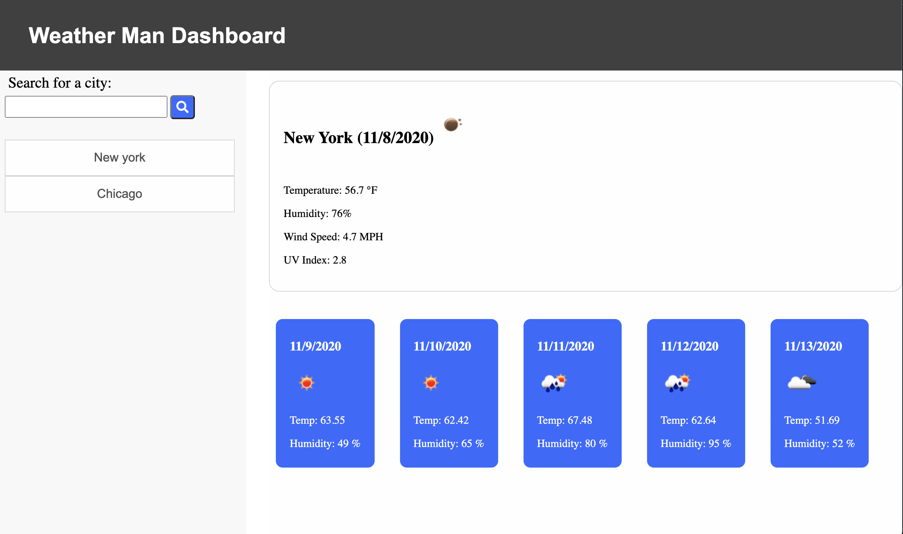

# Weather-Dashboard
What's the weather looking like near you? Or not near you? This app will let you know.

This app is made using HTML, CSS, and JavaScript, as well as some libraries like jqeury, and font-awesome. The app will display current weather, as well as the next 5 days weather, and will also save your recently looked at cities in the side panel, which are all saved in your local storage as a list of objects, and can be accessed just by clicking on them. This app works better on a full browser, but is responsive for mobile sizing. Although not as pretty.

Live app: https://tforde4623.github.io/Weather-Dashboard/

